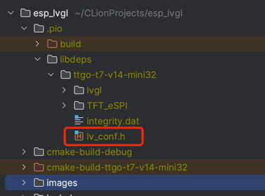

# esp_lvgl

### esp32(我使用的是ttgo开发板) + lvgl + tft_espi 演示demo
### 引入 tft_espi 修改它下面的 [User_Setup.h](.pio%2Flibdeps%2Fttgo-t7-v14-mini32%2FTFT_eSPI%2FUser_Setup.h) 配置
### 在[libdeps](.pio%2Flibdeps)开发板的子目录里
### 参考[User_Setups](.pio%2Flibdeps%2Fttgo-t7-v14-mini32%2FTFT_eSPI%2FUser_Setups)目录选择自己的驱动和屏幕型号

```c
我的配置如下:

#define ST7789_DRIVER

#define TFT_WIDTH  135
#define TFT_HEIGHT 240

#define CGRAM_OFFSET      // Library will add offsets required

//#define TFT_MISO -1

#define TFT_MOSI            19
#define TFT_SCLK            18
#define TFT_CS              5
#define TFT_DC              16
#define TFT_RST             23
#define TOUCH_CS            5  //触摸

#define TFT_BL          4  // Display backlight control pin

#define TFT_BACKLIGHT_ON HIGH  // HIGH or LOW are options

#define LOAD_GLCD
#define LOAD_FONT2
#define LOAD_FONT4
#define LOAD_FONT6
#define LOAD_FONT7
#define LOAD_FONT8
#define LOAD_GFXFF

#define SMOOTH_FONT

//#define SPI_FREQUENCY  27000000
#define SPI_FREQUENCY  40000000   // Maximum for ILI9341


#define SPI_READ_FREQUENCY  6000000 // 6 MHz is the maximum SPI read speed for the ST7789V
```
### 以上就完成了触摸屏的配置

复制 [lv_conf_template.h](.pio%2Flibdeps%2Fttgo-t7-v14-mini32%2Flvgl%2Flv_conf_template.h) 文件为 [lv_conf.h](.pio%2Flibdeps%2Fttgo-t7-v14-mini32%2Flv_conf.h) 将 [lv_conf.h](.pio%2Flibdeps%2Fttgo-t7-v14-mini32%2Flv_conf.h) 文件放在和 lvgl、TFT_eSPI同一层级

```text
参考这个目录层级
esp_lvgl
 |-libraries
   |ttgo-t7-v14-mini32
     |-lvgl
     |-other_lib_1
     |-other_lib_2
     |-lv_conf.h
```



这里只做演示，是使用的官方实例 不想修改太多配置 所以需要拷贝文件
参考这个目录


接下来要修改 [lv_conf.h](.pio%2Flibdeps%2Fttgo-t7-v14-mini32%2Flv_conf.h)  这个文件来完成演示

```c
//第15行修改为
#if 1
//第88行修改为
#define LV_TICK_CUSTOM 1
//第736行修改为
#define LV_USE_DEMO_KEYPAD_AND_ENCODER 1
//第135-141行这些demo使用都需要修改lv_conf.h配置，参考上面第736行，否则编译不通过
```

最后修改 [main.cpp](src%2Fmain.cpp) 文件
```c
//第20 21行为你的屏幕尺寸
static const uint16_t screenWidth  = 135;
static const uint16_t screenHeight = 240;
```

### 参考官方文档 https://docs.lvgl.io/8.3/get-started/platforms/arduino.html
